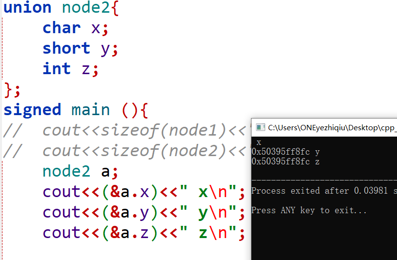
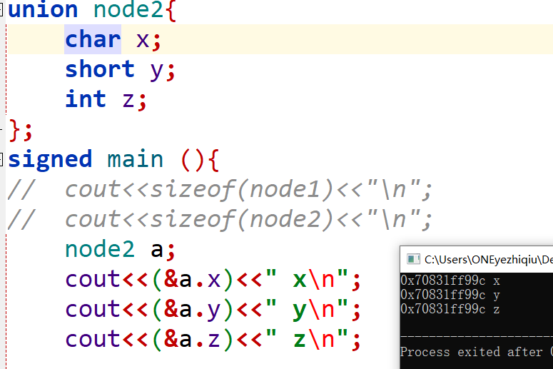

# #Project 0

## 支线任务:

1. 使用 #pragma once 来确保头文件只被编译一次。和\#ifndef差不多，条件编译

   

2. util:实用程序?    lib:静态库?  how 翻译   xx.h=头文件（header file）   src=源代码

   

3. #include“ ”  优先搜索 当前目录，再去找给定地址(从include文件夹开始偏移？)，再搜索标准库  (可能不太对，能搜到关于这个的顺序，但是没看懂，总之找了好几个引入，都是从include开始的，包括include文件夹外的.以后看别的代码再研究)

   

4. 4.1宏定义的参数替换(直接替换) \#define PRINT_NAME(name) printf("我的名字是：%s\n", name)  

   4.2 #：在宏展开的时候会将#后面的参数替换成字符串； **字符串化**（区分上一个）  

   \#define PRINT(name) #name    ==>         PRINT(123)== "123"

   4.3 ##:将前后两个的单词拼接在一起；  #define PRINT(name,value)  #name###value ==> PRINT(abc,123)=="abc123"

   4.4 #@:将值序列变为一个字符；  **字符化** 和4.2应该就是字符个数的差距吧 

   4.5 宏定义也可以用“\”将两行连接起来。 

   

5. 有些注释比如@之类的，不属于语言规范，是Doxygen(以前一直以为和python一样是装饰器之类的，但有感觉有印象是什么注释，没怎么查，这次查了才知道是这种东西，以前页从来没看到第一行/后面更着两个*，还以为是多打了一个)。标准库的注释就是Doxygen风格，应该学习以下，具体见文末附表

   

6. 访问修饰符：public（共有成员）：修饰成员在任意地方都可以访问。

   ​                       private（私有成员）：修饰的成员只能够在类中或者友元函数中可以访问。

   ​                       protected（保护成员）：修饰的成员可以在类中的函数、子类函数及友元函数中访问。

   保护成员变量或函数与私有成员十分相似，但有一点不同，保护成员在派生类（即子类）中是可访问的。

   声明为 private 的成员和声明为 public 的成员的**次序任意**，既可以先出现 private 部分，也可以先出现 public 部分。

   如果既不写 private 也不写 public，就**默认**为 private。

   都是在成员变量和成员函数之前写的，管多个函数或者变量，和java不一样，不用每个前面都写。

   ```C
   class A{
   public:	
   	bool get_is_(){
   		return this->is_;
   	}
   protected:
   	bool is_{false};
   };
   
   A a;
   cout<<a.get_is_();//正确
   cout<<a.is_;//错误
   
   因为默认是私有，所以没有写public下不能直接操作成员变量，要通过public的函数才行
   上面是函数,要有()，下面是变量  ()挺容易忘的
   ```

   

7. bool is_end_{false} ,类中参数后面直接跟着括号:

   MyClass obj{}; 当在声明类对象时使用大括号 `{}` 时，这表示对对象进行**初始化**。这种方式也称为列表初始化或者统一初始化。

   MyClass obj();类名后跟小括号是创建一个对象的方式，表示**调用类的构造函数**来生成一个新的对象。在某些情况下可能导致代码的二义性，因此在创建对象时，建议使用大括号进行初始化或直接省略括号。

   和int a[]={1，2，2}； 差不多，都是初始化

   

8. explicit ：

   explicit关键字只能用于修饰**只有一个参数的类构造函数**, 它的作用是表明该构造函数是显示的, 而非隐式的,

   跟它相对应的另一个关键字是implicit, 意思是隐藏的,类构造函数默认情况下即声明为implicit(隐式).

   作用是防止编译器在某些情况下自动执行隐式类型转换，以提高代码的明确性和安全性

   ```C
   class A{
   public:
       A(int a){
           cout<<"a";
       }
   };
   int main(){
       A a1 = 2;
   }
   //编译可以通过，但是加上explicit之后，这种隐式转换就不能编译通过
   //隐式转化：自动转换类型    显式转换：即强转 用()
   ```

9. virtual ~TrieNode() = default   后面的=default: (C++11)

   ```C
   class X{
   public:
       X(int i){
           a = i;
       }
   private:
       int a;
   };
   X x; // 错误，默认构造函数 X::X()不存在 
   //需要手动写出默认构造函数：X(){};  即重载了构造函数后默认构造函数就不会自动生成了，这样这里就找不到这个默认构造函数了
   //但是手动编写存在两个问题：1. 程序员工作量变大 2. 没有编译器自动生成的默认特殊构造函数效率高。
   //(看上去好像并没有简单，但是特殊情况,复杂起来应该会显得简单点吧)
   ```

   =default 函数特性仅用于类的**特殊成员函数**，且该特殊成员函数没有默认参数。

   这提高了代码的可读性，让其他程序员清楚地知道这些函数是有意生成的，而不是由于遗漏或错误而生成的。

   ```C
   class X {
   public:
       int f() = default: //错误， f()非特殊成员函数
       X(int) = default; //错误， 非特殊成员函数
       X(int i = 1) = default; // 错误， 含有默认参数
   }
   
   //=default 既可以在类体里定义(inline),也可以在类体外(out-of-line)定义
   class X {
   public:
       X() = default; // inline
       X(const X&); // 
       X& operator = (const X&);
       ~X() = default; // inline
   }
   
   X::X(const X&) = default; // out of line
   X& X::operator = (const X&) = default; // out of line
   ```

   

10. =delete:

   为了显式的**禁用**某个函数，C++11 标准引入了一个新特性：deleted 函数。

   ```C
   class X{            
   public: 
     X(); 
     X(const X&) = delete;  // 声明拷贝构造函数为 deleted 
     X& operator = (const X &) = delete; // 声明拷贝赋值操作符为 deleted 
   }; 
   
   class Y{ 
   public: 
       // 禁止使用者在堆上申请对象，因为new就在在堆上new的
     void *operator new(size_t) = delete; 
     void *operator new[](size_t) = delete; 
   }; 
   ```

   

11. this->:

    每个成员函数（包括构造和析构）都有一个this指针。
    this指针**指向调用对象**，即可以通过this关键字访问对象成员。

    ```
    this->成员名;//访问成员变量
    this->函数名();//访问成员函数
    ```

    1.this指针的类型为const，为右值。它的值是不能被修改的，一切企图修改该指针的操作，如赋值、递增、递减等都是不允许的。

    2.this指针本身不占用大小，它并不是对象的一部分，因此不会影响sizeof的结果。
    3.this的作用域在类成员函数的内部。
    4.this指针是类成员函数的第一个默认隐含参数，编译器自动维护传递，类编写者不能显式传递。(和第二条一起应该就是说this用户不用管吧，只管用就行)
    5.只有在类的**非静态成员函数**中才可以使用this指针，其它任何函数都不可以。(从下面static介绍可以看出，静态的要用：：来访问)

    **用不用this-> ：**

    ```c
    int x=3;
    class A{
    public:
    	int x{2};//与int x=2;等价
    	int get_x(){
    		return x;
    	}
    	int get_this_x(){
    		return this->x;
    	}
    };
    
    A a;
    cout<<a.get_x()<<"\n";
    cout<<a.get_this_x();
    //这两个其实都是可以运行的 ,都是输出2
    //因为编译器会自动加上this->，因为和形参没有冲突，与类外全局变量没有任何关系，所以外面的x毫无影响
    int add(int x){
        this->x+=x;
    }
    //这里与形参冲突了，this不加就错了
    ```

    

12. 构造函数：

    在C++的类中，有四类特殊的成员函数：① 默认构造函数；② 拷贝构造函数；③ 拷贝赋值函数（operator=）；④ 析构函数；它们控制着类的实例的创建、初始化、拷贝以及销毁。 

    

    

    

13. 构造函数后面加： 用于初始化 ，还可以跟上父类的构造函数

    A( int aa, int bb ):a(aa),b(bb)
    {
    }
    相当于
    A( int aa, int bb )
    {
    a=aa;
    b=bb;
    }

    与

    TEST（int a,int b ）： parents（a, b）

    

14. 

    

    

    

    

    

15. 析构函数

    一个类中有且仅有一个析构函数（所以=delete不能用于析构函数），它是一个无参无返回值且不能被重载的特殊成员函数，由系统自动调用，析构函数如果被重写，则系统会调用重写的版本，否则调用隐式生成的默认版本： 

    

    

    

16. &取地址 与参数是指针如何处理：

    ```c
    例1：
    std::string *p = &s;  //p指针，用s取地址后赋值
    例2：
    void fuc(A* a);
    A b;
    fuc(&b);//传入的参数是A类型的指针， 同例1，传入&,传入地址
    
    主线任务里面里面有一个函数
    std::unique_ptr<TrieNode> *GetChildNode(char key_char)
    从这里看应该要传回一个指针，所以需要加上&
    ```

    有时会有 void fuc(const A& a); 这种函数声明的写法，这样的好处是：既不想在函数中变实参，又可以省略形参实参赋值的消耗。

    

17. 传入参数中的&&:

    && 是右值引用

18. 

    

    

    

    

19. bool HasChild(char key_char) const { return false; }        后面跟着一个const

    我们定义的类的成员函数中，常常有一些成员函数不改变类的数据成员，也就是说，这些函数是"只读"函数，而有一些函数要修改类数据成员的值。如果把**不改变数据成员的函数**都加上const关键字进行标识，显然，可提高程序的可读性。其实，它还能提高程序的可靠性，**已定义成const的成员函数，一旦企图修改数据成员的值，则编译器按错误处理**。

    函数后加const的三种情况：

    1、 非静态成员函数后面加const（加到非成员函数或静态成员后面会产生编译错误）
    2、 表示成员函数隐含传入的this指针为const指针，决定了在该成员函数中，任意修改它所在的类的成员的操作都是不允许的（因为隐含了对this指针的const引用），唯一的例外是对于mutable修饰的成员。
    3 、（1）加了const的成员函数可以被非const对象和const对象调用
       （2）不加const的成员函数只能被非const对象调用

    

    在函数返回值前加const，则表示是一个常量：例如下面两个例子

    const int getValue();

    int getValue2() const;

    ```C
    #include<iostream>
    using namespace std;
     
    class Test
    {
    public:
        Test(int a)
        {
            this->a = a;
        }
        static void print_static() //const     //1.错误
        {
            cout<< "静态成员函数" <<endl;
        }
        void print_const() const
        {
            //a++;   //2.错误
            cout << "加const的成员函数" <<endl;
        }
        void print()
        {
            cout<< "普通成员函数" <<endl;
        }
    private:
        int a;
    };
     
    int main()
    {
        const Test t1(10);
        Test t2(20);
        t1.print_const();
        //t1.print();       //3.错误 const对象不能调用非const函数
        t2.print_const();
        t2.print();
        return 0;
    }
    ```

    

20. **static修饰符**:

       由关键字static修饰类中成员，成为类的静态成员。类的静态成员为其所有对象共享，**不管有多少对象**，静态成员只有**一份**存于公用内存中。静态数据成员被当做该类类型的全局对象。我们不能把静态成员的初始化放置在类的定义中，但是可以在类的外部通过使用范围解析运算符 :: 来重新声明静态变量从而对它进行初始化。

    存储空间是程序执行**main函数之前分配**的，在实例化对象不再为静态成员分配空间

    设计静态数据成员的目的是信息共享,只会被初始化一次，于实例无关

    优势：

    1. 静态数据成员没有进入程序的全局名字空间，因此不存在与程序中其他全局名字冲突的可能性

    2. 可以实现信息隐藏，静态成员可以是private，而全局变量不能 

       

       

       

       

21. **static与const区别**： (const!=static)

    

    

    

    

22. extern "C"

23. extern 

    

    

    

    

24. 函数重载

25. 内联函数 

    内联函数最初的目的：代替部分 #define 宏定义：

    宏是预处理指令，在**预处理**的时候把所有的宏名用宏体来替换；内联函数是函数，在**编译阶段**把所有调用内联函数的地方把内联函数插入；
    宏没有类型检查，无论对还是错都是**直接替换**；而内联函数在编译时进行**安全检查**；
    宏的编写有很多限制，例如不能使用return控制流程等；
    对于C++ 而言，使用宏代码还有另一种缺点：无法操作类的私有数据成员。

    

    

    使用内联函数替代普通函数的目的：提高程序的运行效率；

    

    内联函数一般的要求如下：

    1. 函数简短，通常3-5行；

    2. 函数内没有复杂的实现，比如：包含while、for 循环，递归等；

    3. 通常在多处有调用；

    复杂函数一般不展开，总之，函数声明为内联，仅仅是对编译器的建议，如果函数比较复杂，编译器会将其看做普通函数

    

    

26. 

    

    

    

    

    

    

27. noexcept：(C++11 新关键字)

    用法1：指定函数是否抛出异常。预先知道函数不会抛出异常有助于简化调用该函数的代码，而且编译器确认函数不会抛出异常，它就能执行某些特殊的优化操作。

    void func(int x) noexcept(true);    //不抛出异常 

    void func(int x) noexcept(false);   //抛出异常

    void func(int x) noexcept;          //不抛出异常 (默认式true)

    使用位置是跟在 函数参数列表之后 

    用法2：用作运算符，是一个一元运算符，它的返回值是一个bool类型的，用于表示给定的表达式是否会抛出异常。

    noexcept(f()); //如果f()不抛出异常则结果为true，否则为false 

    

28. 命名空间：(本来不准备写了，但是看构造函数的时候看到下面代码，又没搞懂：：不知道是不是命名空间)

    ：：三种用法

    1)global scope(全局作用域符），用法（::name)
    2)class scope(类作用域符），用法(**class::name**)
    3)namespace scope(命名空间作用域符），用法(namespace::name)

    ```C
    #include <iostream>
    #include <string.h>
    using namespace std;
    class Person {
    public:
        int age;
        char* name;
     
        Person(int age, char* name);  //一般构造函数
        Person(char* name);  //转换构造函数
     
    };
    Person::Person(int age, char* name) {
        this->age = age;
        this->name = name;
    }
     
    Person::Person(char* name) {  //转换构造函数
        this->name = name;
    }
    ```

    

29. 使用new :（以前一直偷懒没学）

    new开辟的空间存储在堆上，而我们定义的变量存储在栈上(一直用的是定义变量然后赋值过去，但还是有区别的)

    new分配的空间使用delete释放，new[] 使用 delete[]。

    用法 就是 new +对象，然后返回值就是一个指针

    区分:

    ```C
    int* pi = new int(5);//表示动态分配一个int ，初始化为 5
    int* pa = new int[5];//表示动态分配一个数组，数组大小为5
    ```

    

30. unique_ptr<>  std::unique_ptr\<TrieNode> *GetChildNode(char key_char) :（这里的星号是？）

31. map：(和stl以前学的时候，用的内容应该都差不多，应该没有项目多需要的东西吧？有的话以后补)

    查找：mp[]  或者 mp.find() 或者mp.count()     优先用第二个(mp[]失败后会插入)，失败返回mp.end()

    删除:  mp.erase(值 or 迭代器)  

    mp.find() 返回值是一个迭代器，可以用it->first，it->second访问键值对，**类型**:map<?>::iterator  ，和指针不一样

    

    

    

    

    

32. **虚函数**

33. 指针函数和函数指针

    

    

    

    

    

    

    

    

    

    

    

    

    

    

    

    

    

    

    

34. 类中 各个函数和成员变量之间  顺序

    成员变量和函数之间是没有顺序关系的，不需要和外面一样，调用的函数要定义在调用点之前

    ```C
    class A{
    public:	
    	int get_(){
    		return get_x();
    	}
    	int get_x(){
    		return this->x;
    	}
    	A()=default;
    	~A()=default;
    private:
    	int x{122};
    };
    
    A a;
    cout<<a.get_();//正确
    ```

    

35. **模板元编程**:(即TrieNodeWithValue的template \<typename T>) 

    

    

36. T GetValue(const std::string &key, bool *success) :

    参数const 类型 & 名称 ：

    

    

    

    

37. 构造函数前面是没有返回值的，而且构造函数 不需要去给成员变量去new出来，显然 里面的变量是能自动生成的。

    (主线里面第一个类的构造函数，上面两个简单类型的我就写了赋值，下面哪个hashmap 我就傻乎乎的在那搞上面new的赋值。

    构造函数功能基本上是初始化，而不是去生成成员变量，平时虽然看上去很显然，真复杂了，也脑子短路不知道干了啥，特地记一下，省的以后再犯病)

    ```C
    explicit TrieNode(char key_char) {//构造函数，没有返回值，只是多了一个explicit修饰 (看到这个想到，要是真不懂explicit和构造函数，可能真的把explicit当成是这个函数的返回值类型，只能说C++细节还是很多的，不一个一个查和了解，好多东西看上去稍微懂一点，最后放一起就形成了完全看不懂的局面了)
          this->is_end_=false;
          this->key_char_=key_char;
          this->children_.clear();//一开始在new生成 这个成员变量，很蠢
      }
    ```

38. constexpr : (utility标准库里可以看到的)

    **常量表达式**：指的就是由多个（≥1）常量组成的表达式。换句话说，如果表达式中的成员都是常量，那么该表达式就是一个常量表达式。这也意味着，常量表达式一旦确定，其值将无法修改。

    C++ 程序的执行过程大致要经历编译、链接、运行这 3 个阶段。常量表达式和非常量表达式的计算时机不同，非常量表达式只能在程序运行阶段计算出结果；而常量表达式的计算往往发生在程序的编译阶段，这可以极大提高程序的执行效率，因为表达式只需要在编译阶段计算一次，节省了每次程序运行时都需要计算一次的时间。

    constexpr 关键字的功能是使指定的常量表达式获得在程序编译阶段计算出结果的能力，而不必等到程序运行阶段。C++ 11 标准中，constexpr 可用于修饰普通变量、函数（包括模板函数）以及类的构造函数

    **获得在编译阶段计算出结果的能力，并不代表 constexpr修饰的表达式一定会在程序编译阶段被执行，具体的计算时机还是编译器说了算。**

    

    1.使用 constexpr 修改普通变量时，变量必须经过初始化且初始值必须是一个常量表达式

     C++11 标准规定，浮点常量表达式在编译阶段计算的精度要至少等于（或者高于）运行阶段计算出的精度。

    ```c
    int num=6;
    //int a[num]={1,2,3,4,5,6};//[错误] size of array 'a' is not an integral constant-expression
    const int N=6;
    int a[N]={1,2,3,4,5,6};
    constexpr int M=6;
    int b[M]={1,2,3,4,5,6};//两个修饰都表示他是常量，均能通过编译，区别见下一条
    ```

    

    2.constexpr还可以用于修饰函数的返回值，这样的函数又称为“常量表达式函数”。

    一个函数要想成为常量表达式函数，必须满足如下 4 个条件：

    1) 整个函数的函数体中，除了可以包含 using 指令、typedef 语句以及 static_assert 断言外，**只能包含一条 return 返回语句**。（直到C++14）

    ```C
    constexpr int get(int x){
    	int ret = 1 + 2 + x;
    	return ret;
    }
    //c++11 不能过编译，14可以
    ```

    2）返回值不能为void

    3） 函数在使用之前，必须有对应的定义语句。我们知道，函数的使用分为“声明”和“定义”两部分，普通的函数调用只需要提前写好该函数的声明部分即可（函数的定义部分可以放在调用位置之后甚至其它文件中），但常量表达式函数在使用前，必须要有该函数的定义                    (这条分清楚定义和声明应该就能理解了，声明是int get(); 定义是 int get(){return x;} )

    4）return 返回的表达式必须是常量表达式。

    

    3.对于 C++ **内置**类型的数据，可以直接用 constexpr 修饰，

    但如果是**自定义**的数据类型（用 struct 或者 class 实现），直接用 constexpr 修饰是不行的。

    

    4.constexpr 修饰类的构造函数时，要求该构造函数的**函数体必须为空**，且采用初始化列表的方式为各个成员赋值时，必须使用**常量表达式**。

    

    5.constexpr 可以修饰模板函数，但由于模板中类型的不确定性，因此模板函数实例化后的函数是否符合常量表达式函数的要求也是不确定的。针对这种情况下，C++11 标准规定，如果 constexpr 修饰的模板函数实例化结果不满足常量表达式函数的要求，则 constexpr 会被自动忽略，即该函数就等同于一个普通函数。

    

39. const与constexpr区别

    constexpr 是 C++ 11 标准新添加的关键字，在此之前（C++ 98/03标准）只有 const 关键字，其在实际使用中经常会表现出两种不同的语义

    

    

    

    

40. union

    union是一种可以存储不同类型数据的数据结构。union与struct很相似，只不过union中所有成员**共享同一块内存空间**，用于节约内存空间。在访问union的成员时，只会访问到**最后一次赋值的成员**，因此需要特别注意。

    ```c
    struct node1{
    	char x;
    	short y;
    	int z;
    };
    union node2{
    	char x;
    	short y;
    	int z;
    };
    
    cout<<sizeof(node1)<<"\n";//8 因为有内存对齐的存在，所以是8 (内存对齐就是2字节 必须从半字位置开始放，4字节就必须从整字位置开始放)
    cout<<sizeof(node2)<<"\n";//4 取所有大小的max即可
    
    union MyUnion {
        int i;
        float f;
    };
    
    MyUnion u;
    u.i = 10;
    cout << u.f << "\n";  // 输出不可预料结果
    u.f = 3.14;
    cout << u.i << "\n";  // 输出不可预料结果
    
    cout<<u<<"\n";//这种也是错的，虽然只有一个生效(仅逻辑上，理解上的一个生效)，但还是需要写哪个成员变量
    
    //大概可以理解为union中间所有变量只有一个是会生效的，只是不知道谁生效，所以占用空间是取max的
    //从这个想到了408 有一年真题是计网和ds一起考，要写出那个网络拓扑图的数据结构定义，那时候不知道这个union作用，以为和struct是一个东西，现在想想，从那个题就能知道union的作用，因为一个结点只会有一种类型的状态，用union可以省空间，用struct，必然会亏一点空间，那个里面只需要用一个标记记录用union中哪个变量即可。
    ```

    编译器**无法保证类的构造函数和析构函数得到正确的调用**，由此，就可能出现内存泄漏。所以，在C++中使用union时，尽量保持C语言中使用union的风格，尽量不要让union带有对象。

    (union可以检测大小端，具体见后面)

    (本来应该结束了，但是发生了奇怪的事情)

    

    

    （应该是抽风了，选择无视）

    

41. return {};  直接返回一个空的对象，就不需要new一个空的，再返回了，在模板元中用起来很方便。

42. UB：

    未定义行为（Undefined Behavior，简称UB）是指程序在运行时的行为没有被编程语言或标准所定义，因此其结果是不确定的。这意味着，当程序出现未定义行为时，它可能会产生任何结果，包括崩溃、错误的输出、安全漏洞等。

    未定义行为通常是由于编程错误、不当的语言使用或编译器实现的问题导致的。例如，当程序试图访问未初始化的变量、使用空指针、越界访问数组等时，就可能会产生未定义行为。

43. 大小端：（大端是低地址记录高位信息(MSB),下面例子是记录0x0001这个数字）(X86结构是小端模式)

    大端:   地址： 0x01 0x02

    ​                             00     01

    ```C
    方法1：
    int i = 1;
    (*(char*)&i == 1) ? printf("Little-endian\n") : printf("Big-endian\n");
    方法2： //这个好理解一点，但和上面拿个思路其实一样，就是int 用char解析，截取一段看
    void checkCPU()
    {
        union MyUnion{
            int a;
            char c;
        }test;
        test.a = 1;
        if (test.c == 1)
            cout << "little endian" <<endl;
        else cout << "big endian" <<endl;
    }
    //用union共用同一内存来检测
    //a:0x00000001  如果是小端，就是 01 00 00 00 存放，用char来解析这串二进制，就看到了第一个字节的01
    //大端的话 00 00 00 01 ，看到的就是00 
    ```

    


## 主线任务：

### p0_trie.h代码结构+任务

在bustub命名空间下完成TrieNode，TrieNodeWithValue，Trie三个类的编写（ctrl+单击bustub到了type_id.h,没看懂里面是什么，后面补）

#### TrieNode：

普通结点

##### 变量：

key_char_ ：记录这个点上的字符

is_end_ :标记是不是叶子结点

children_：类型是：std::unordered_map<char, std::unique_ptr\<TrieNode>>，和C实现的tr\[?][26]一样

##### 函数

TrieNode：首先，是个构造函数，按照要求只要简单赋值加初始化即可

这里重载了构造函数，但是没处理默认构造函数，应该是别的地方用不到这个默认构造函数，我选择加上TrieNode()=default;


### TrieNodeWithValue


### Trie


## 附表1：Doxygen

```
Doxygen是一种开源跨平台的，以类似JavaDoc风格描述的文档系统，完全支持C、C++、Java、Objective-C和IDL语言，部分支持PHP、C#。鉴于Doxygen良好的注释风格，故基于Doxygen以形成自己的注释规范。

vscode自己写，输入/***/ 后敲回车自动展开(可能需要插件支持)
格式是
/**  这里是两个* 与普通的一个*的多行注释不同，代表是doxygen注释
*	 doxygen可以自动生成注释文档，但得按照要求写，得注释在每个实体的前面，然后是至少俩行。跟在代码后面注释用///< 
*    具体的话看懂就行，现在应该还用不着
*	 主要是记几个@???，不认识查就行了
*/


以下比较重要的：@brief  @warning  @bug  @brief @details  @return  @param  @var、@enum、@struct、@class

@exception <exception-object> {exception description} 对一个异常对象进行注释。

@warning {warning message } 一些需要注意的事情

@todo { things to be done } 对将要做的事情进行注释，链接到所有TODO 汇总的TODO 列表

@bug 缺陷，链接到所有缺陷汇总的缺陷列表

@see {comment with reference to other items } 一段包含其他部分引用的注释，中间包含对其他代码项的名称，自动产生对其的引用链接。

@relates <name> 通常用做把非成员函数的注释文档包含在类的说明文档中。

@since {text} 通常用来说明从什么版本、时间写此部分代码。

@deprecated

@pre { description of the precondition } 用来说明代码项的前提条件。

@post { description of the postcondition } 用来说明代码项之后的使用条件。

@code 在注释中开始说明一段代码，直到@endcode命令。

@endcode 注释中代码段的结束。

@code .. @endcode 包含一段代码

@addtogroup 添加到一个组。

@brief  概要信息                   

@deprecated 已废弃函数

@details  详细描述

@note  开始一个段落，用来描述一些注意事项

@par  开始一个段落，段落名称描述由你自己指定

@param  标记一个参数的意义

@fn  函数说明

@ingroup 加入到一个组

@return  描述返回意义

@retval  描述返回值意义

@include 包含文件

@var、@enum、@struct、@class 对变量、枚举、结构体、类等进行标注
```


##### time：

from 2024.1.2 to ?